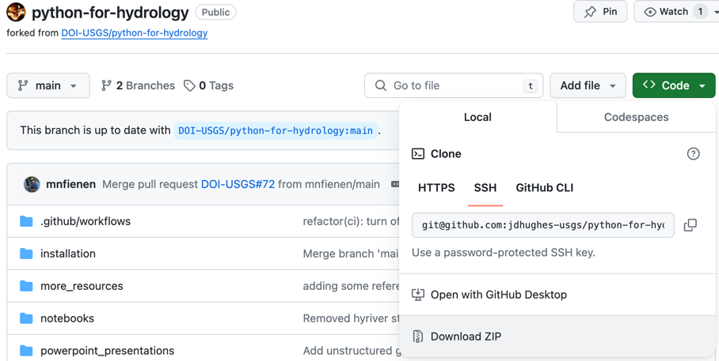

# python installation instructions

If you have another python distribution (Conda, Miniconda, Micromamba, Miniforge, _etc._) installed on your laptop skip to the [next step]((#class-environment-installation-instructions)). Otherwise,

1. Download the appropriate version of [Miniforge for your operating system](https://github.com/conda-forge/miniforge?tab=readme-ov-file#miniforge3).

   * [Windows](https://github.com/conda-forge/miniforge/releases/latest/download/Miniforge3-Windows-x86_64.exe)
   * [MacOS x86_64](https://github.com/conda-forge/miniforge/releases/latest/download/Miniforge3-MacOSX-x86_64.sh)
   * [MacOS Apple Silicon (arm64)](https://github.com/conda-forge/miniforge/releases/latest/download/Miniforge3-MacOSX-arm64.sh)
   * [Linux x86_64](https://github.com/conda-forge/miniforge/releases/latest/download/Miniforge3-Linux-x86_64.sh)
   * [Linux aarch64 (arm64)](https://github.com/conda-forge/miniforge/releases/latest/download/Miniforge3-Linux-aarch64.sh)

2. For Windows operating systems, double-click on the downloaded executable installation file. Do not change the default for the `Add Miniforge3 to my PATH environment variable` so that Miniforge does not cause conflicts with existing installed software.

3. For MacOS and Linux operating systems, open a terminal in the directory that the installation script was downloaded to. Run

    ```shell
    sh Miniforge-pypy3-OS-arch.sh
    ```

   where `OS-arch` above is the operating system and architecture (MacOSX-x86_64, MacOSX-arm64, Linux-x86_64, or Linux-aarch64).

# Class python environment installation instructions

For Windows operating systems, open the "Miniforge Prompt" installed to the start menu. For MacOS and Linux operating systems, open a terminal. Navigate to the directory where you downloaded the `environment.yml` file that was included in the email with software installation instructions. Type the following command

```shell
mamba env create -f environment.yml
```

# Download the class git repository

Using the terminal you opened in the [previous step](#class-environment-installation-instructions), navigate to a directory where you want to download the class repository to. Once in the selected directory, type the following command

```shell
git clone https://github.com/DOI-USGS/python-for-hydrology.git
```

If you are unable to clone the class repository (`SSLError`, _etc._) using the `git clone` command, [open the repository in a browser](https://github.com/jdhughes-usgs/python-for-hydrology) and download it directly using the `Download ZIP` option shown in the image below.



Move the the downloaded zip file (`python-for-hydrology-main.zip`) to the selected directory that you executed the `git clone` command in and unzip the file.

**Let one of the class instructors know if neither of the options for obtaining the class repository work for you.**

# Test the class environment

After successful installation of the class environment and downloading the class repository navigate to the `installation` directory in class repository.

```shell
cd python-for-hydrology/installation
```

Activate the class python environment by typing the following command

```shell
conda activate pyclass
```

## Test the basic class environment installation (Part 0)

Test the basic class environment installation by typing the following command

```shell
python test_installation.py
```

If the basic class environment was successfully installed, `Successful testing of the basic class environment for Part 0` will be printed to the terminal. **Let one of the class instructors know if the basic class environment installation test is not successful.**

## Test the flopy installation (Part 1)

If taking part 1 of the class, install MODFLOW executables by typing

```shell
get-modflow :python
```

Then type the following command to test the flopy installation

```shell
python test_flopy_installation.py
```

If the class environment was successfully installed for Part 1 of the class, `Successful testing of class environment for Part 1` will be printed to the terminal. **Let one of the class instructors know if the class environment installation test is not successful for Part 1 of the class.**


