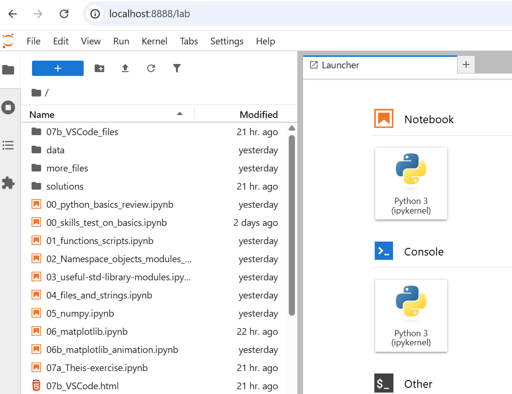
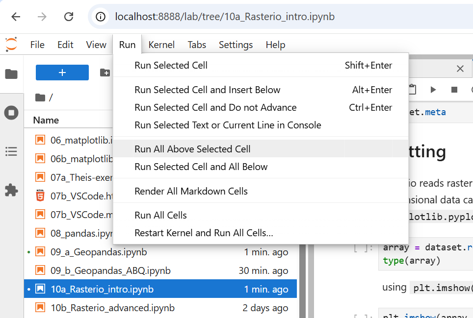
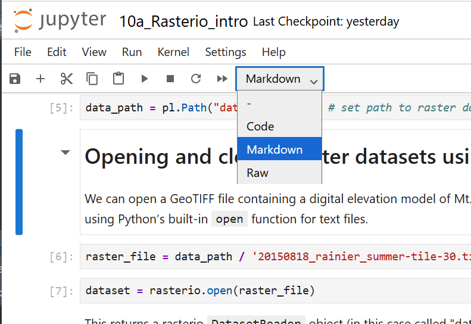

# Jupyter Lab

Jupyter Lab will be used to view and interact with Python Notebooks.

## Starting Jupyter

### Windows

1. Open Miniforge Prompt

2. Navigate to the notebooks folder:

For example:

```
cd python-for-hydrology/notebooks/part0_python_intro
```

3. Activate the pyclass environment (this assumes the installation steps were already performed).

```
conda activate pyclass
```

4. Launch JupyterLab with the command:

```
jupyter lab
```

A browser should open up:



Choose Python 3 (ipykernal)

5. Choose one of the .ipynb files

## Using Jupyter

Code blocks can be run with "Shift + Enter".

You can pick a spot in the notebook and run all 
the code up until that point. To do that, place your 
cursor in the place you want the code to run to. Go 
to the Run menu and choose "Run all above selected cell".



Text notes can be added by adding a cell and choosing "Markdown":


You could just use some HTML in your Markdown:




